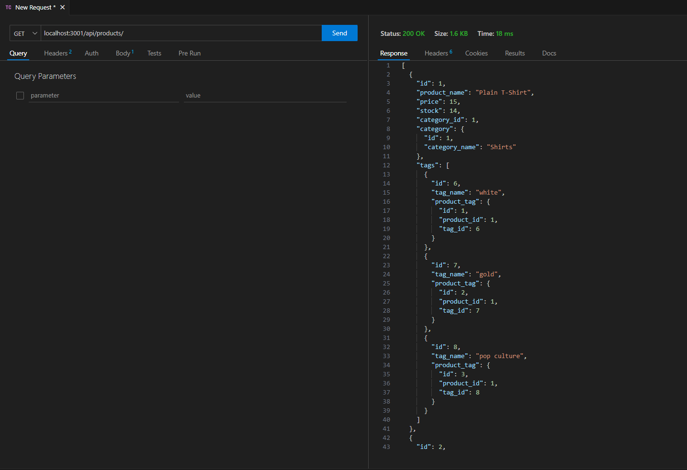

# e-commerce Backend

## Github Repo Link
https://github.com/FullPersonDev/ecommerce

## Walkthrough video Link
https://drive.google.com/file/d/19xPQ8deSk2UuMrKhC549VnRADfvgJtz1/view

## Instructions - To start application
- Source Schema: Go to db directory and open in integrated terminal. Login to your mysql. Once in mysql, type: Source schema.sql
- Seed Database: Go to root directory and open in integrated terminal. Type: node seeds/index.js
- Start Application: Go to root directory and open in integrated terminal. Type: npm start
- Go to service like 'Insomnia' or 'Thunder Client', to interact with the routes.

## Working Application - screenshot
